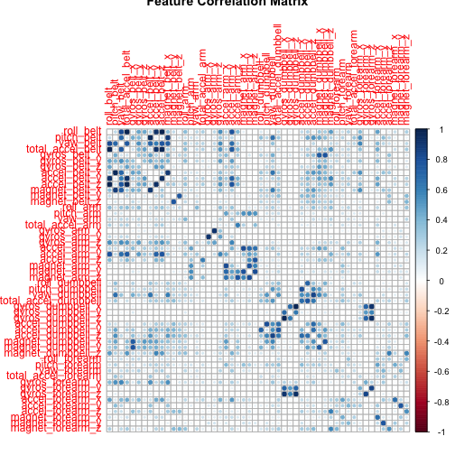

Practical Machine Learning Project Report
========================================================

## Background

Using devices such as Jawbone Up, Nike FuelBand, and Fitbit it is now possible to collect a large amount of data about personal activity relatively inexpensively. In this project, the goal will be to use data from accelerometers on the belt, forearm, arm, and dumbell of 6 participants. They were asked to perform barbell lifts correctly and incorrectly in 5 different ways. More information is available from the website here: http://groupware.les.inf.puc-rio.br/har (see the section on the Weight Lifting Exercise Dataset). 

## Data

The training data for this project is available here: 

https://d396qusza40orc.cloudfront.net/predmachlearn/pml-training.csv

The test data is available here: 

https://d396qusza40orc.cloudfront.net/predmachlearn/pml-testing.csv

The data for this project come from this source: http://groupware.les.inf.puc-rio.br/har. If you use the document you create for this class for any purpose please cite them as they have been very generous in allowing their data to be used for this kind of assignment. 

## Goal

The goal is to predict the manner in which they did the exercise. This is the "classe" variable in the training set which could be one of the following:

* A - exactly according specification
* B - elbows to the front
* C - lifting the dumbbel only halfway
* D - lowering the dumbbel only halfway
* E - throwing the hips to the front

## Load libraries


```r
library("caret")
library("rpart")
library("rpart.plot")
library("corrplot")
library("rattle")
```


## Loading Data


```r

# Training set
training <- read.csv(url("http://d396qusza40orc.cloudfront.net/predmachlearn/pml-training.csv"))

# Testing set
testing <- read.csv(url("http://d396qusza40orc.cloudfront.net/predmachlearn/pml-testing.csv"))

# Verify data is loaded
dim(training)
dim(testing)
```


## Cleaning Data

Clean both the test and training datasets.


```r
# Remove classe from training and problem_id from testing
classe <- training$classe
training$classe <- NULL

problem_id <- testing$problem_id
testing$problem_id <- NULL

# Lets combine the dataset
combi <- rbind(training, testing)

# Remove columns with no relation to our problem
combi$raw_timestamp_part_1 <- NULL
combi$raw_timestamp_part_2 <- NULL
combi$cvtd_timestamp <- NULL
combi$new_window <- NULL
combi$num_window <- NULL
combi$X <- NULL

# Break the combined features test and train again
train <- combi[1:19622, ]
test <- combi[19623:19642, ]

# Subset only numeric columns
train <- train[, sapply(train, is.numeric)]
test <- test[, sapply(test, is.numeric)]

# Remove columns with NA
train <- train[, colSums(is.na(train)) == 0]
test <- test[, colSums(is.na(test)) == 0]

# Add the Classe to the train dataset.
train$classe <- classe

# Plot feature correlational matrix
correlationMatrix <- abs(cor(train[, 1:52]))
diag(correlationMatrix) <- 0
corrplot(correlationMatrix, main = "Feature Correlation Matrix")
```

 


## Building the model

We'll fit a predictive model using Random Forest algorithm with a 5-fold cross-validation.
 

```r
# Set seed for reproducibility
set.seed(5626)

# Split training data into train (70%) and test data (30%)
inTrain <- createDataPartition(train$classe, p = 0.7, list = FALSE)
trainData <- train[inTrain, ]
testData <- train[-inTrain, ]

# Using RF algorithm with 5-fold cross validation
control.rf <- trainControl(method = "cv", 5)
modFit.rf <- train(classe ~ ., data = trainData, method = "rf", trControl = control.rf, 
    ntree = 10)
modFit.rf
```

```
## Random Forest 
## 
## 13737 samples
##    52 predictor
##     5 classes: 'A', 'B', 'C', 'D', 'E' 
## 
## No pre-processing
## Resampling: Cross-Validated (5 fold) 
## 
## Summary of sample sizes: 10989, 10990, 10990, 10989, 10990 
## 
## Resampling results across tuning parameters:
## 
##   mtry  Accuracy  Kappa   Accuracy SD  Kappa SD
##    2    0.9775    0.9715  0.002322     0.002937
##   27    0.9847    0.9807  0.002318     0.002935
##   52    0.9761    0.9697  0.005065     0.006412
## 
## Accuracy was used to select the optimal model using  the largest value.
## The final value used for the model was mtry = 27.
```


## Out of sample error
Expected out of sample error is 1.09%


```r
set.seed(5626)

# Lets predict the classe for testData
predict.rf <- predict(modFit.rf, testData)
```

```
## Loading required package: randomForest
## randomForest 4.6-7
## Type rfNews() to see new features/changes/bug fixes.
```

```r

# Out of sample accuracy is the number of correct predictions over number of
# predictions.
OutOfSampleAccuracy <- sum(predict.rf == testData$classe)/length(predict.rf)
OutOfSampleAccuracy
```

```
## [1] 0.9891
```

```r

# Expected Out of sample error rate
OutOfSampleError <- round((1 - OutOfSampleAccuracy) * 100, 2)
OutOfSampleError
```

```
## [1] 1.09
```


## Predict on test data

Predictions:


```r
result.rf <- predict(modFit.rf, test)
```

```
## Error: object 'test' not found
```

```r
result.rf
```

```
## Error: object 'result.rf' not found
```


## Writing predictions to txt files


```r
# Write predctions to txt files
pml_write_files <- function(x) {
    n = length(x)
    for (i in 1:n) {
        filename = paste0("problem_results/problem_id_", i, ".txt")
        write.table(x[i], file = filename, quote = FALSE, row.names = FALSE, 
            col.names = FALSE)
    }
}
pml_write_files(result.rf)
```

```
## Error: object 'result.rf' not found
```

